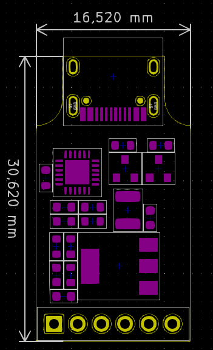
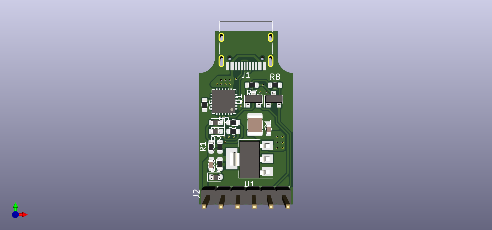
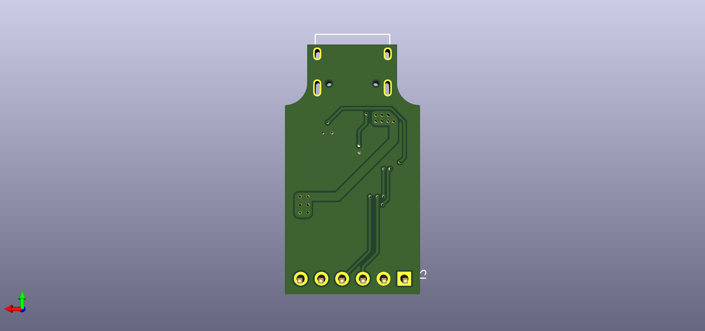

# usb_debuger

## Hardware

### Schematics

### PCB Layout

#### Parameter

#### Top side

#### Back side

### 3D

#### Top side

#### Back side

### Gerber

Version 1.0

- [Gerber V0.0](./assets/demo/gerber.rar)

### Remark

This project was in development phase - we will remove this remark after release

# License
